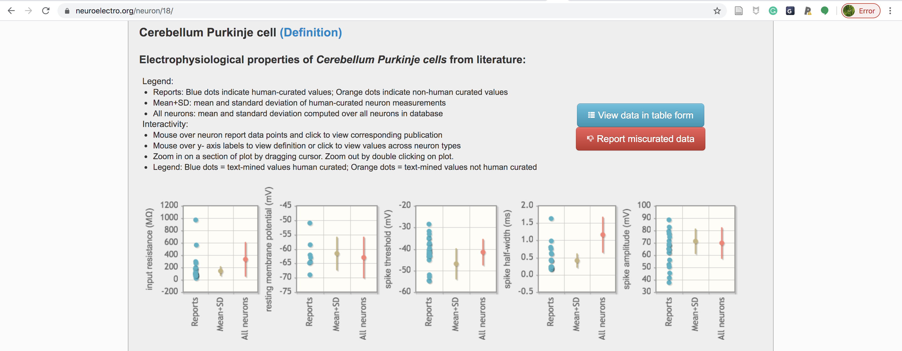
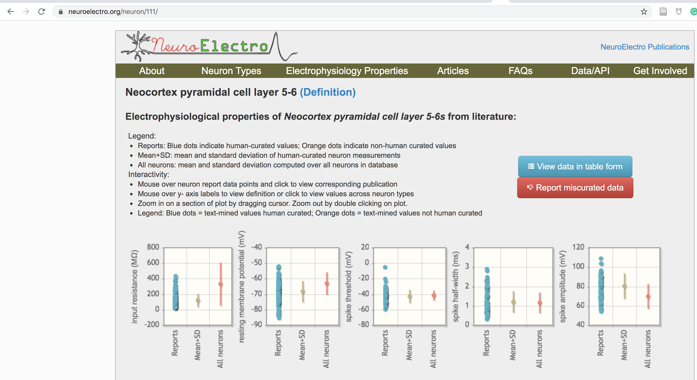
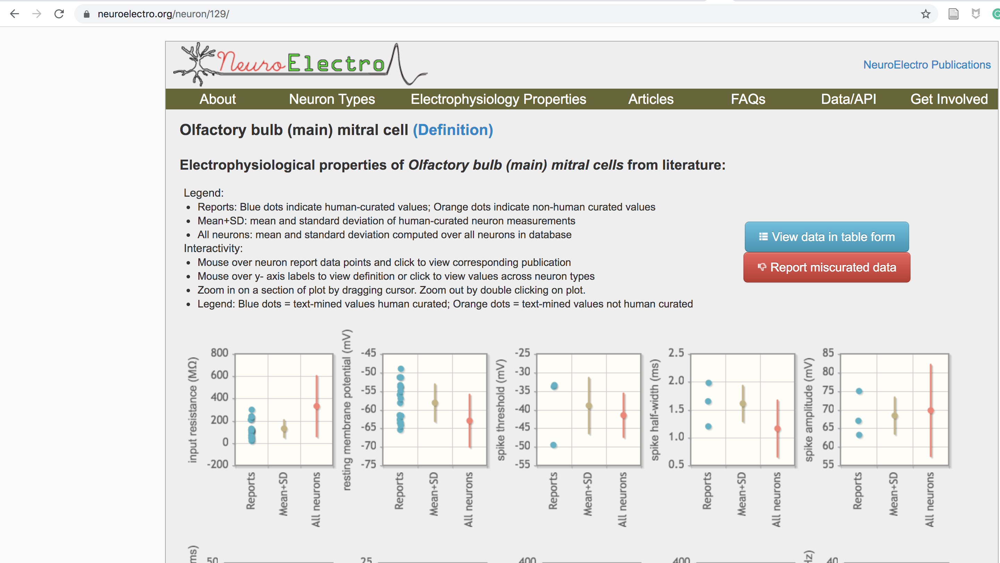
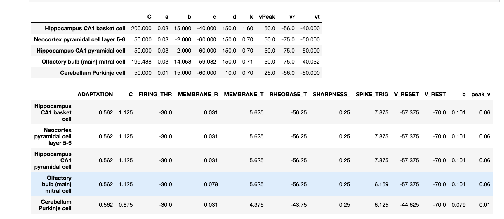
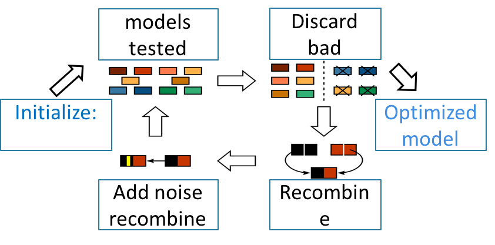

## Data used to constrain each of 8 Cellular Models

| cell type| id | neurolex id| 
| ------------- |:-------------:| -----:|
| purkinje | 18 | sao471801888 |
| Neocortex pyramidal cell layer 5-6| 111 | nifext_50| 
| Olfactory bulb (main) mitral cell | 129 | nlx_anat_100201 |
| Hippocampus CA1 pyramidal cell | 85 | sao830368389 |

At the website:
https://www.neuroelectro.org/neuron
Putting the id numbers on the end of the URL is sufficient to get each data source. For example to get the Cerebellum Purkinje cell:

https://www.neuroelectro.org/neuron/18

To do this programmatically the neurolex id is used: sao471801888

## Optimized Models Used:

## Izhikevich model
Izhikevich, Eugene M. "Simple model of spiking neurons." IEEE Transactions on neural networks 14.6 (2003): 1569-1572.
PubMed 15484883

## adaptive exponential model
Brette, Romain, and Wulfram Gerstner. "Adaptive exponential integrate-and-fire model as an effective description of neuronal activity." Journal of neurophysiology 94.5 (2005): 3637-3642
PubMed 16014787

To [download this data as a word document](https://github.com/russelljjarvis/CNS2020/raw/gh-pages/Images/Models_info.docx
)

purkinje ={"id": 18, "name": "Cerebellum Purkinje cell", "neuron_db_id": 271, "nlex_id": "sao471801888"}
pvis_cortex = {"id": 111, "name": "Neocortex pyramidal cell layer 5-6", "neuron_db_id": 265, "nlex_id": "nifext_50"}
#This olfactory mitral cell does not have datum about rheobase, current injection values.
olf_mitral = {"id": 129, "name": "Olfactory bulb (main) mitral cell", "neuron_db_id": 267, "nlex_id": "nlx_anat_100201"}
ca1_pyr = {"id": 85, "name": "Hippocampus CA1 pyramidal cell", "neuron_db_id": 258, "nlex_id": "sao830368389"}

 
