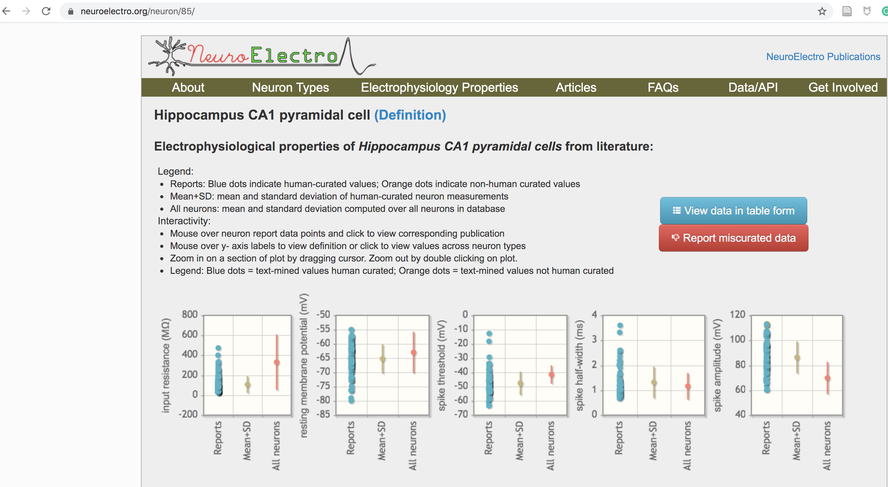

## Data used to constrain each of 8 Cellular Models

| cell type| NeuroElectro id | neurolex id| link |
| ------------- |:-------------:| -----:| -----:|
| Cerebellar Purkinje Cell | 18 | sao471801888 | https://www.neuroelectro.org/neuron/18/ |
| Neocortex pyramidal cell layer 5-6| 111 | nifext_50| https://www.neuroelectro.org/neuron/111/ |
| Olfactory bulb (main) mitral cell | 129 | nlx_anat_100201 | https://www.neuroelectro.org/neuron/129/ |
| Hippocampus CA1 pyramidal cell | 85 | sao830368389 | https://www.neuroelectro.org/neuron/85/ |

What are the seven models that you mention that you optimize? Can you make a table with seven rows. Give each model a name. What is the original publication (author and pubmed id). What is the link to the data used? I can't make sense of what you are showing here.

| Model Class | cell type| PubMed id | data source link | 
| ------------- |:-------------:| -----:| -----:|
| Izhikevich model | purkinje | 15484883 | https://www.neuroelectro.org/neuron/18/ |
| Izhikevich model | Neocortex pyramidal cell layer 5-6| 15484883 | https://www.neuroelectro.org/neuron/111/| 
| Izhikevich model | Olfactory bulb (main) mitral cell | 15484883 | https://www.neuroelectro.org/neuron/129/ |
| Izhikevich model | Hippocampus CA1 pyramidal cell | 15484883 | https://www.neuroelectro.org/neuron/85/ |
| Adaptive Exponential model| purkinje | 16014787 | https://www.neuroelectro.org/neuron/18/ |
| Adaptive Exponential model| Neocortex pyramidal cell layer 5-6| 16014787 | https://www.neuroelectro.org/neuron/111/ | 
| Adaptive Exponential model| Olfactory bulb (main) mitral cell | 16014787 | https://www.neuroelectro.org/neuron/129/ |
| Adaptive Exponential model| Hippocampus CA1 pyramidal cell | 16014787 | https://www.neuroelectro.org/neuron/85/ |

At the website:

Appending the `id` number to the end of the URL https://www.neuroelectro.org/neuron is sufficient to get each data source. For example to get the Cerebellum Purkinje cell:

https://www.neuroelectro.org/neuron/18

To do this programmatically the neurolex id is used: sao471801888

## Optimized Models Used:

## Izhikevich model
Izhikevich, Eugene M. "Simple model of spiking neurons." IEEE Transactions on neural networks 14.6 (2003): 1569-1572.
PubMed 15484883

## Adaptive Exponential model
Brette, Romain, and Wulfram Gerstner. "Adaptive exponential integrate-and-fire model as an effective description of neuronal activity." Journal of neurophysiology 94.5 (2005): 3637-3642
PubMed 16014787

 
